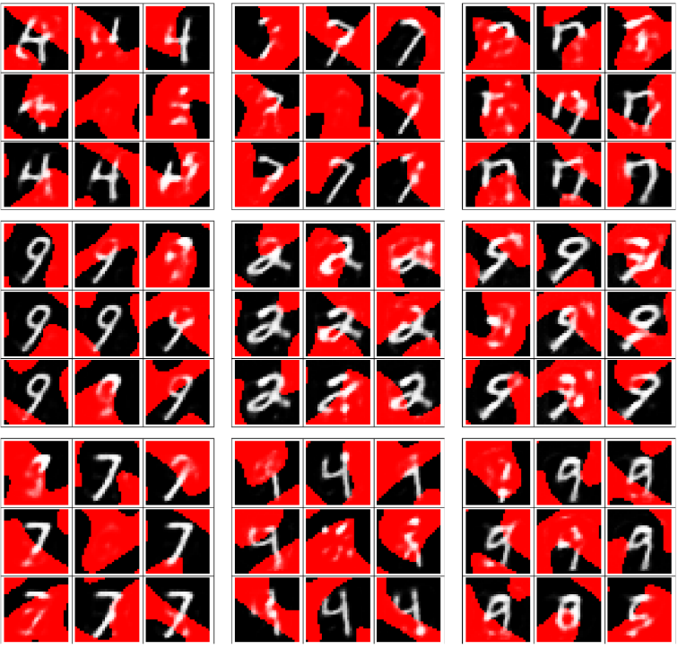
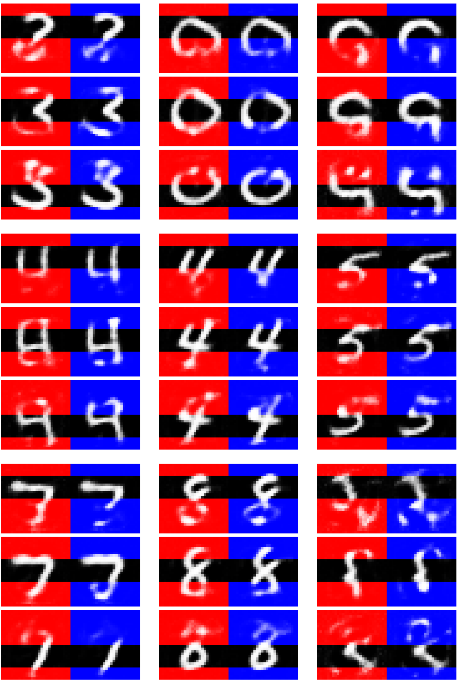

Today I was trying to find a way to use fake inputs combined with weighted loss to correct inputs and I seem to have found a way

Also, I was playing around with the idea of using narrative forms[^2] to extract information from the system, for the system's use

---

First you load in the data

```Mathematica
dat = Splice@
     Import[#, 
      "Data"] & /@ {(...**)};
dat = #[[2 ;; -1]]/255. & /@ N@dat;
ByteCount@dat
Length@dat
```

```Mathematica
encf = Flatten@*ImageData;
decf = Image@Partition[#, 28] &;
sl = Length@dat[[1]]
```

Then you have to make a net to fake input with:

```Mathematica
dl = 32;
net = NetChain[{
   NetChain[{ApproximatorLayer[512, dl], ElementwiseLayer[Sin]}], 
   NetChain[{ApproximatorLayer[512, sl], 
     ElementwiseLayer["Sigmoid"]}]
   }, "Input" -> sl]
NetSize@net
```

Then train it:

```Mathematica
net = Check[
  NetTrain[net, <|"Input" -> dat, "Output" -> dat|>, 
   TimeGoal -> 15*60, 
   LossFunction -> {"Output" -> MeanSquaredLossLayer[]}], net]
```

Note: I stopped training mine before 15 minutes; probably trained for more like 3 minutes. Now we want to make a cradle[^1] net for training the fake input tensor:

```Mathematica
finet = SimpleNetGraph[{
   {"fi" /; NetArrayLayer[LearningRateMultipliers -> 1] -> "f" /; net,
      "Target", "LossMask"} -> 
    ThreadingLayer[(#1 - #2)^2 #3 &] -> 
     AggregationLayer[Total, All] -> "OutLoss"
   }, {"Target", "LossMask", "OutLoss"}, "OutLoss" -> "Real"]
```

Make some corrupted data to train the net on:

```Mathematica
ShowTiny@decf[fitest = dat[[1]]];
ShowTiny@decf[
  lmask = Flatten1@Table[If[j > 14, 1., 0.], {i, 28}, {j, 28}]]
ShowTiny@decf[fitest = tov[fitest, RandomReal[{0, 1}, sl], 1 - lmask]]
```

Then train the net:

```Mathematica
finet = Check[
  NetTrain[finet, {<|"LossMask" -> lmask, "Target" -> fitest|>}, 
   TimeGoal -> 15*60, LearningRateMultipliers -> {"f" -> None}, 
   LossFunction -> {"OutLoss"}], finet]
```

The net has to be trained with every new input. Here are some sample outputs:



```Mathematica
lmask = 1 - encf@RandomBlotch["Size" -> 28, "Threshold" -> .5];
fitest = tov[fitest, RandomReal[{0, 1}, sl], 1 - lmask];
ShowTiny@ImageApply[
  If[#2 < 0.5, {1, #1, #1}, {1, 1, 1} #1] &, {decf@
    net@NetExtract[finet, "fi"][], decf@lmask}]
```

The red background regions are the loss weights = 0 regions which also are set to random noise in `Target`. This is the region that gets corrected and why the result is fucked up in this area. The system is generally *ok* at finding a kind-alright fake output. Note: you have to put the fake input into the net to get the corrected output

Heres the same thing but with a fixed mask, and comparing no elementwise sine (red) with elementwise sine (blue):



Using the elementwise sine activation function as the last layer of the encoder appears to work *slightly* better *maybe*

Remember: these results are pretty shitty, but this is a unique way of correcting data which I've never got to work in the past; and, a person looking at almost any one of these uncorrected images (just the black background parts of the images above) probably won't have much difficulty correcting them. But that's because we contextualize the problem *much* deeper than this network possibly can. For instance, we know exactly what MNIST examples look like: we have an encoder for MNIST examples already trained in our heads. We have an encoder for a superset of MNIST containing many more types of characters and numerals and other glyphs, and that has rotational and translational invariance, and that generalizes extremely well using a possibly unknown algorithm. And we can contextualize the problem using the mask itself, along with the other examples we see. Our brains are extremely greedy for prior information related to problems we're trying to solve, and we can potentially use *all* information available to us to encoder and decode information. Furthermore, our encoders operate in time which means we also are using information we've just seen, and which possibly gives other benefits

---

Just like I was saying the other day: using a sequence predictor on N tokens to 1 token is equivalent (for the most part) to querying a semantic graph / knowledge base by completing a semantic triple / 3-tuple. eg: query the system with`(dog, likes, ____)` and get `kibbles`; but with tokens with internal semantics which are generally compositions of more simple representations. And, it is also equivalent to applying a function on N parameters

Sequence predictors can also be used to describe things and get information. For instance, if you put "The eiffel tower is in " into GPT-J you get "The eiffel tower is in the centre of paris. It is the tallest  structure in paris. It is a masterpiece of engineering. It represents  gandhi, who was born in india. There is a statue of gandhi on the roof of the eiffel tower." ... Ok, the stuff about gandhi afaik isn't fuckin true, but the eiffel tower is in the center of paris, and it is the tallest structure in paris

Information extraction via sequence next-element prediction isn't just useful for humans, though; there's no reason the system itself couldn't make use of it to query its own knowledge. eg: 'I just saw X, I should ' the system 

And remember: sequence prediction isn't just confined to discrete symbols like words: if you are going to compress a sequence, set, etc of representations down to a narrative form[^2], then you can use whatever (timewise-evolution-correlated) semantics you want, and map any sequence of narrative forms to another narrative form, allowing whole concepts (situations, complex objects, etc) to evolve in time


---

[^1]: A cradle is what I call a net which is used to train another net, but isn't itself intended to be used for anything. Like a literal cradle which contains the growing, sleeping baby net. But once the baby net grows into an adult net it won't live its life inside the cradle
[^2]: Narrative forms are extremely compressed version of things. They only encode the highest levels of information. Probably only the information that would actually be communicated to others. Probably also highly correlated with sequences of narrative forms in time. This is as close to human semantic level of information compression that you will get for the systems' use (I imagine; at this point)
