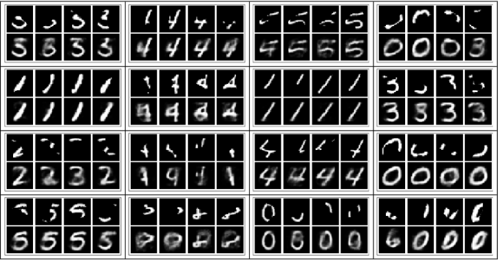
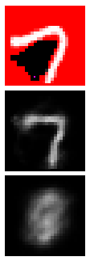
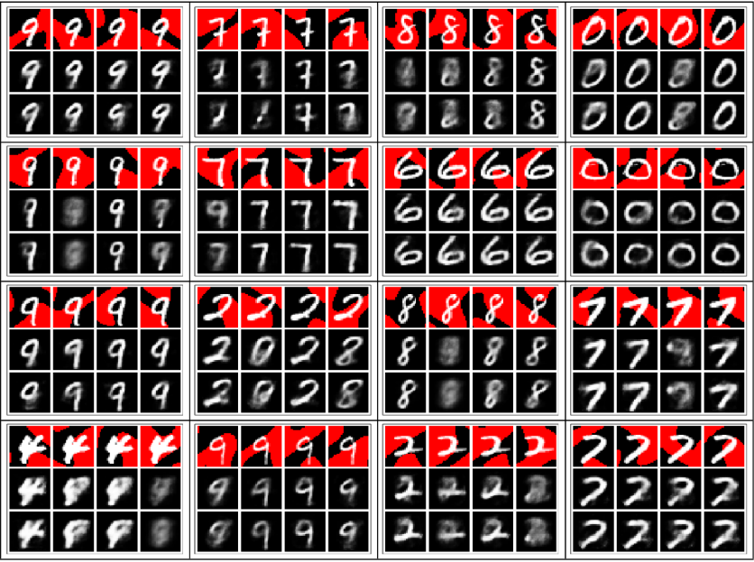
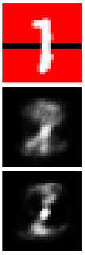
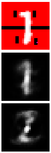

Just for fun I tried to make a blotch corruption invariant AE

---

Load the data in:

```Mathematica
dat = Splice@Import[#, "Data"] & /@ {(*...*)};
dat = #[[2 ;; -1]]/255. & /@ N@dat;
ByteCount@dat
Length@dat

encf = Flatten@*ImageData;
decf = Image@Partition[#, 28] &;
sl = Length@dat[[1]]
```

Just a simple and extremely basic bitch AE[^1] for the net (though I did use a shift approximator for the encoder):

```Mathematica
dl = 512;
net = NetChain[{
   "e" -> 
    NetChain[{ShiftApproximator[256, 4, dl], ElementwiseLayer[Sin]}],
   "d" -> 
    NetChain[{ApproximatorLayer[512, sl], ElementwiseLayer["Sigmoid"]}]
   }, "Input" -> sl]
NetSize@net
```

Notice that `dl = 512` which is the dimension of the encoding the AE generates. If our objective is to reduce the dimensionality of the inputs, then we can get away with like `dl = 16` or even `dl = 8` or whatever, but since we are instead trying to create an invariant representation, we shouldn't care that the encoding is large (because dimensionality-reduction isn't the point here!)

Then make some blotches. Alternatively you can just generate new ones each batch, but that is slow and since we are going to be combining thousands of mnist examples with thousands of blotch examples -- so repeats will be pretty unlikely -- it doesn't really matter that we generate them before (I think):

```Mathematica
bls = Table[
   encf@RandomBlotch["Size" -> 28, 
     "Threshold" -> RandomReal[{0.3, 0.8}]], {4*1024}];
```

Train:

```Mathematica
net = Check[
  NetTrain[net, 
   Table[#*RandomChoice@bls -> # &@RandomChoice@dat, #BatchSize] &, 
   TimeGoal -> 15*60, 
   LossFunction -> {"Output" -> MeanSquaredLossLayer[]}], net]
```

The results are much better and more interesting than I was anticipating. I really did the full 15 minutes this time, and the loss graph leveled off essentially completely



It seems like the output is consistent with a weighted mean of all images which have 1s where the input has 1s and ignoring the 0s. This makes sense because 0s don't provide any information since the blotches just replace 1s with 0s, and the optimizer prefers to converge to the mean of several possible good output, so you get an average of those possible matching outputs

---

Then I tried using the same setup, but also giving the network the mask information as well. As expected, it did better. That's because when the system knows which areas are 0s, it won't try to add 1s in those spots, which eliminates presumably many possible outputs



Here, the red area indicates the area that is masked. The real input to the net has the red area replaced with 0s. The second subimage is the output, the bottom subimage is the output of the mask-less net discussed above. As you can see, the net with mask is able to produce an output even if no 1s are provided. It's able to use just the mask to determine the most likely output



Just for fun, heres an image which shows how the net (effectively) produces an average from a bunch of different possible outputs, so to catch them all and decrease the loss *on average*



Then you add a little more information to the mask to let the net know that there are real 0s at certain locations, and so the net removes the examples that don't have 0s in those spots from the average calculation (effectively) 



---

[^1]: `Approximator[a,b,f]` is like: `NetChain[{LinearLayer[a],ElementwiseLayer[f],LinearLayer[b]}]`, and shift approximators are a little bit more complicated but are basically a sequence of approximators which add together with some small factor... Mehh, it's source is at the bottom of this page

```Mathematica
ShiftApproximator = 
 With[{size = #1, n = #2, outsize = #3, ops = {##4}}, 
   NetChain[{LinearLayer[size], 
     Splice[Table[
       ShiftActivatedLinearLayer[size, First[ops, Tanh], 
        1 - (1/3.)^(1/n)], n]], LinearLayer[outsize]}]] &
```

```Mathematica
ShiftActivatedLinearLayer = Function[{size, act, prop},FunctionLayer[tov[#1, ActivatedLinearLayer[size, act][#1], prop] &]]
```

```Mathematica
tov[x_, y_, u_] := x + (y - x) u
```

```Mathematica
ActivatedLinearLayer = Function[{size, act}, NetChain[{LinearLayer[size], ElementwiseLayer[act]}]]