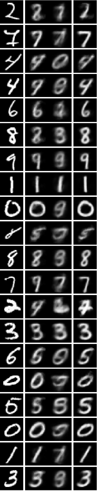

Today I wanted to see if I could train coupled encoders such that one of the encoders adds what amounts to orthogonal information for decoding / expansion

This looks like:

* First train an AE `d1 e1 = a1`
* Then train a coupled AE `d(e1, e2) = a`, with `e1` fixed; this means training `d` and `e2` only
* Then finally train `d2 e2 = a2`, with `e2` fixed

The first training correlates `d1` and `e1` to the training set and causes `e1` to compress only the most relevant information from the input. Then the second training correlates `d` and `e2` with the training set and `e1`, but since the most relevant information is produced with `e1`, this causes `e2` to compress only the second most relevant information form the input. Then the third training correlates only `d2` with `e2` and the training set, and is for the purposes of evaluating the quality of `e2`'s compression -- which should specifically be worse than `e1`'s compression

---

Here's some code:

Load the data:

```

dat = Splice@
     Import[#, 
      "Data"] & /@ {".../data/mnist/train/x00", ...};
dat = #[[2 ;; -1]]/255. & /@ N@dat;
ByteCount@dat
Length@dat

encf = Flatten@*ImageData;
decf = Image@Partition[#, 28] &;
sl = Length@dat[[1]]
```

A shift approximator is a deep approximator where individual layers add together to *shift* the eventual output slightly. I'm not exactly sure why, but these seem to outperform regular approximators in many cases, and in some cases drastically outperform them... Here, I load the first network and train `d1 e1`

```
tov[x_, y_, u_] := x + (y - x) u

ShiftActivatedLinearLayer = 
 Function[{size, act, prop}, 
  FunctionLayer[tov[#1, ActivatedLinearLayer[size, act][#1], prop] &]];

ShiftApproximator2 = 
  Function[{size, n, outsize, act}, 
   NetChain[{LinearLayer[size], 
     Splice[Table[
       ShiftActivatedLinearLayer[size, act, 1 - (1/3.`)^(1/n)], n]], 
     LinearLayer[outsize]}]];

dl = 1;
net1 = SimpleNetGraph[{
   "Input" -> 
    "e1" /; ShiftApproximator2[128, 4, dl, Sin] -> 
     "d1" /; NetChain[{ApproximatorLayer[256, sl], 
         ElementwiseLayer["Sigmoid"]}] -> "Output1"
   }, {"Input", "Output1"}, "Input" -> sl]
NetSize@net1

net1 = Check[
  NetTrain[net1, <|"Input" -> dat, "Output1" -> dat|>, 
   TimeGoal -> 5*60, 
   LossFunction -> {"Output1" -> MeanSquaredLossLayer[]}], net1]
```

Now load and train the synthesis network `d(e1, e2)` with `e1` held

```
nets = SimpleNetGraph[{
   {"Input1", 
     "Input2" -> "e2" /; ShiftApproximator2[128, 4, dl, Sin]} -> 
    CatenateLayer[] -> 
     "d" /; NetChain[{ApproximatorLayer[256, sl], 
         ElementwiseLayer["Sigmoid"]}] -> "Output"
   }, {"Input1", "Input2", "Output"}, "Input1" -> dl, "Input2" -> sl]
net1e = NetExtract[net1, "e1"]
NetSize@nets

nets = Check[
  NetTrain[nets, <|"Input1" -> net1e@dat, "Input2" -> dat, 
    "Output" -> dat|>, TimeGoal -> 5*60, 
   LossFunction -> {"Output" -> MeanSquaredLossLayer[]}], nets]
```

Now load and train `d2 e2` with `e2` held

```
net2 = SimpleNetGraph[{
   "Input" -> 
    "d2" /; NetChain[{ApproximatorLayer[256, sl], 
        ElementwiseLayer["Sigmoid"]}] -> "Output2"
   }, {"Input", "Output2"}, "Input" -> dl]
NetSize@net2

netse2 = NetExtract[nets, "e2"]

net2 = Check[
  NetTrain[net2, <|"Input" -> netse2@dat, "Output2" -> dat|>, 
   TimeGoal -> 5*60, 
   LossFunction -> {"Output2" -> MeanSquaredLossLayer[]}], net2]
```

Then show a few examples and how well they are reproduced by the AEs. Note: the synthesis net will perform better than the others visually (and that would be true in general, because it uses more information from the input), but the important thing is that the `d2 e2` net (the second one here) performs worse than the `d1 e1` net because `e2` is trained to supplement `e1`'s information in the synthesis net, and so won't encode the most significant information

```
Column@Table[Row@{
    ShowTiny@decf[tmp1 = RandomChoice@dat], " ",
    ShowTiny@decf@net1@tmp1,
    ShowTiny@decf@net2@netse2@tmp1, " ",
    ShowTiny@
     decf@nets@<|"Input1" -> net1e@tmp1, 
        "Input2" -> tmp1|>
    }, {20}]
```

Finally, check the perform of the training set

```
res = {
  msl@<|"Input" -> net1@dat, "Target" -> dat|>,
  msl@<|"Input" -> net2@netse2@dat, "Target" -> dat|>,
  msl@<|"Input" -> nets@<|"Input1" -> net1e@dat, "Input2" -> dat|>, 
    "Target" -> dat|>
  }
```

The output of res: `{0.0520027, 0.059225, 0.0411038}`

These are the losses from a trial with encoding size `dl = 1` and around 5 minutes each training session. This pattern of middle for `d1 e1`, highest for `d2 e2`, and lowest for `d(e1, e2)` persists across all trials. Indicating that `d2 e2` does always perform worse than `d1 e1` because it encodes less important information, but that `e2`'s contributed information in `d(e1, e2)` is significant. In short: yes `e2` is encoding not the most important but second to the most important information, `e1` encodes the most important information, and `e1`'s and `e2`'s contributions are 'orthogonal' for expansion

The output for `dl = 2` on 25k mnist train examples for 5 minutes each training session: `{0.0434957, 0.0550351, 0.0304608}`

Here is the `Column@Table[Row@{...` example table:



The leftmost image on each row is the original example, the center 2 are the individual AE recreations (left: `d1 e1`, right: `d2 e2`), and the rightmost image is the synthesis net recreation `d(e1(x), e2(x))`. Notice that the `d2 e2` net performs worse visually than the `d1 e1` net, and the synthesis performs much better than the other two. If my idea is right, the `e2` encoder is picking out information from the input that is essentially 'orthogonal' to the information the `e1` encoder is picking out, and since `e1` is likely picking the most important information, `e2` is likely picking the next most important information for recreating the input. This means that `e2`'s information is inferior to `e1`'s information, but since `e2`'s information is orthogonal to `e1`'s information, combining `e1`'s and `e2`'s information improves the synthesis net's decoding

Incidentally, also notice the caricaturization of the inputs in some of the decoded recreations. This is interesting and is evidence for abstraction. For instance, in the second row, the synthesis net decodes the input (a 7? I'm not sure what tf that is) as a 7 without the flourishing

---

It seems like the information `e2` encoded doesn't actually have to be specifically orthogonal to `e1`'s information because what information `e2` learns to encode isn't actually constrained in any way, but just that the training process encourages `e2` to improve on `e1` in the synthesis net. So `e2` will tend to find information that improves the synthesis net, and the most important information from the input is already caught by `e1`, so it won't be the best information. `e2` may incidentally encode some of the best information, but in order for there to be an improvement `e2` has to encode information that isn't caught by `e1`, and that must inevitably be the next best information

This is much more obvious when you have a high encoding dimension `dl >= 784` for instance, so `e1` actually uses essentially all the information in the input. But `e2` also still makes a perfect encoder and uses all the information (not entirely sure at this point why this is, though)

To counter this I tried training the synthesis net first on `d(e1, 0)` to correlate `d` to `e1` only; effectively making `d` only decode `e1`. Then I trained `e2 = 0` so it would produce the zero in the synthesis net, and inserted that net back into the synthesis net for retrained it as `d(e1, e2)`. This encourages the net to change `d` and `e2` in tandem so that they only improve upon `d(e1, 0)`'s results. This brought back `d2 e2`'s terrible results, which may indicate that `e2` is now only extracting information more or less orthogonal to `e1`, but terrible results from non-standard initializations seem common in general, so...

---

One potential practical consequence of this is that you can order the information (in an encoded form) from some input. I'm not sure what you can do with that yet, but it's worth examining, I think

