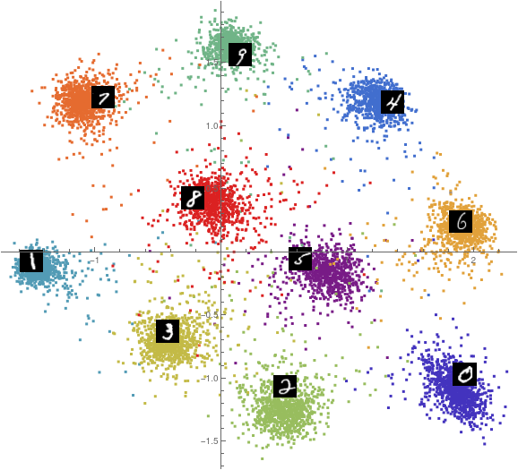

I was working on a bunch of different things. Heres a few of them

---

Encoded set objects

Equivalence looks like $f\ x = f\ y$, which is really saying two things: that there is a function that produces some output, and that $\exists S$ such that $\forall x, y \in S$, $f\ x = f\ y$. The function component $f$ and the equivalence component are potentially separable

Define $f = g\ s$ such that $\forall x, y \in S$, $s\ x = s\ y$, and $g$ produces $f$'s functionality after applying $s$

What is the output of $s$, though? Its an encoding of the set $S$, or of multiple sets. It produces a unique value for each set that it's trained on. Then $g$ is the part of $f$ that turns encoded set objects like the output of $s$ into the intended output

This has the benefit that if you have many function $F = \{f_i\}_i$ all of which are equivalent under the same sets, then you can replace all with: $f_i = g_i\ s$ and only have to train one $s$ with that equivalence relation

As far as I can tell, these encoded set objects are *exactly* equivalent to the concept of an internal representation. Essentially an internal representation's only source of meaning is that it is represents many things in one (eg: all dogs into the symbolic dog; every realspace geometric transformation of a fork into the symbolic fork; etc). This means that a representation $r$ produced by a function $f$ gets its meaning by being the output of $f\ x = r$ for every element of a set

Just like there is dimensionality reduction / compression, there is an encoded 'set'[^1] indexing / expansion function $u(s, c) = y$ which pulls information out of a 'set' object. With this viewpoint in mind its easy to see that, from the perspective of expansion, the 'type' of an internal representation is like a container which is indexible via functions like $u$, the information content is some function of the size of the set it represents and the size of the representation (whatever size means wrt information content)

Some more potential set-ish operations are: set packing $p(s, x, c) = s'$ which includes things in a set object, and set removal $r(s',c) = r(p(s,x,c),c) = s$

I also actually implemented a set representer function like this using an ANN network that decreases the distance between same-set elements, and increases the distance between different-set elements. It seems to work really well. It tends to push different set representation clusters away from eachother first, then collapse each one to a singular point

```mathematica
net = With[{s = 
    NetInsertSharedArrays[
     NetChain[{ApproximatorLayer[256,2]}], 
     "s"]}, SimpleNetGraph[{
    "Input1" -> "s1" /; s, "Input2" -> "s2" /; s, 
    "Input3" -> "s3" /; s,
    {"s1", "s2"} -> MeanSquaredLossAdapterLayer[] -> "Loss1",
    {"s1", "s3"} -> MeanSquaredLossAdapterLayer[] -> "Loss2"
    }, {"Input1", "Input2", "Input3", "Loss1", "Loss2"}, 
   "Input1" -> 2, "Input2" -> 2, "Input3" -> 2]]
```

(Where `MeanSquaredLossAdapterLayer` just puts `NetPort@"Input2"` to `NetPort@"Target"` of a `MeanSquaredLossLayer`). And loss functions:

```mathematica
LossFunction -> {"Loss1", "Loss2" -> ElementwiseLayer[10^-2./(#^2 + 10^-3.)&]}
```

The `10^-2` and `10^-3` components in the `Loss2` function could be called $\alpha$ and $\beta$ or something; they roughly control how spread out the network makes the clusters it produces

Note for this network: you can add noise to the output of each `s` vector during training to stop the set clusters from collapsing. And nother note: you probably add a very slight preference bias for `Loss2` over `Loss1` if you don't prevent inputs `Input1` and `Input2` from being the same value 

Here's 10k MNIST examples encoded into $\mathbb{R}^2$ via the above net with noise



---

It occurred to me that a lossy functions lossiness is probably measurable with something like: $D(f, X) = \frac{1}{\left|X\right|}\sum_{x \in X} \delta(x \ne f^{-1}\ f\ x ) = \left|\{x \ne f^{-1}\ f\ x\ |\  x \in X\}\right| / \left|X\right|$ where $\delta(\textrm{true})=1,\ \delta(\textrm{false})=0$. This is for discrete functions. And probably with like $D(f,X,k) = \frac{1}{N}\sum_{x\in X} k(\left|x - f^{-1}\, f\ x\right|)$ or something, for continuous functions where $k$ is positive everywhere and monotonically increasing, and $N$ is something something normalization something

And also that there is an analogy of equivalence in *lossy* / compressing / dredding functions with *gainy* / expanding functions. Since you need new information to add information, gainy functions look like $f(x, c) = z$, and so $f(x, a) \ne f(x, b)$ is the equivalence analog. And *maybe* something like if you define $g(f(x, a)) = x$ for all $a$ then $g(x) = g(y)$ makes $f$ a *gainy* function

---

And some stuff about typing and automatic programming:

An `Unknown(T)` type which effectively makes structured / indexible types atomic. eg: `Unknown(Vector) vec` has a member `x` but `vec.x` is type `Unknown(Real)`. The idea being that a particular procedure knows that an object is a particular type, but doesn't know what its value is yet. This may be particularly important for information greedy systems like one which collects all information it can, and likes to attach that information to objects. So this system might go online learn from some database somewhere that the mystery `Any` value it has is actually a vector, but it still doesn't know the vector's value, so to store that information as a type without defining it, it sets the types as `Unknown(Vector)` instead

`Unknown(T)` types are related to atomic types and structured types with partially-defined values / member values. For example, a `Real` that also has type `OnInterval(-1, 1)`, which would be accurately defined as an `Unknown(OnInterval(-1, 1))`; or a `Vector` on in type `Around(Vector(1,0),0.5)` which would be more accurate with `Unkown(Around(Vector(1,0),0.5))`. This is because it's assumed that a `T x` is a single element from the set of all `T`, but an `Unknown(T) x` could be anything from `T`

For sticky / information greedy systems like above, you could also have a type like `WithMetadata(T) x` which otherwise makes `x` look just like a `T`, but it has another member `x.meta` which is some database of information that might look like something that has `x.meta.creator`, `x.meta.from`, `x.meta.usedIn`, etc. For any data, really

And also potentially a type like `Same` which is like a container of interpretations of the same object, and which are equivalent up to that interpretation. For caching purposes probably

Its also worth stating / restating the `ReturnedFrom(f)` type: if a value has this type then it was specifically returned from the function `f`. ie: `x = foo(...)` means `x` is a `ReturnedFrom(foo)`. And this is intersected with whatever the function's return type is, too. eg: if you have a function type like `SortsList` then a type like `SortedList` is essentially equivalent to `ReturnedFrom(quickSort)` which is necessarily equivalent to `ReturnedFrom(SortsList)` or whatever. Notice that these types all have human semantics, and that you can immediately understand their meaning using your brains treatment of their word percepts with your brain's correlation with your experience. Highly automated programming likely involves mostly nameless types and function which all have internal semantics (their meaning comes from their correlation with the system's internal functionality, and the data they've seen). But also notice that highly flexible and information greedy systems will likely name internally correlated, nameless functions, or have a way to generate names for these function. More complex function will likely have much longer names than are practically usable in this case. But there probably are still ways to surrogate a procedure to generate the function name; eg: `makeProcedure("take a list and sort it based on the geographic location of the elements")` (note: flexible systems can handle this even if the elements don't have explicit geographic locations and even if it doesn't make any sense at all) which is necessarily an agi-like / ai-complete procedure that uses it's correlations to translate human semantics to the program's internal semantics. Also note: `makeProcedure` might not immediately take a string as argument, but instead the system chains functions using their types to first bridge string to something `makeProcedure` can use

---

[^1]: You don't actually index sets to get their elements so these aren't quite sets in actuality. Though, if you consider $u(s, c)$ as taking the intersection between a set $s$ and another set $c$ (despite them not sharing the same semantics), then you

