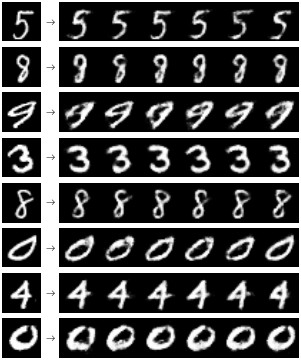
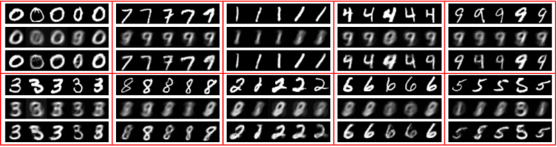

Trained a set min random loss based net on an MNIST AE task overnight
And, trained an MNIST dred decoder informed by a rough memory layer

---

Set min random loss based net:

This was on inner AE dimension `dl=10`, and on `5 x 5000` examples

Just like [may 22 2021](may-22-2021.md), but trained overnight with this training schedule:
* 1 hour w/ $10^0$ log-space standard deviation
* 2 hours w/ $10^1$
* 1 hour w/ $10^2$

Heres an example of the results


I should probably try this again overnight with a `dl=2` or something equivalently really low, as opposed to the `dl=10` that I used here, so that there is a higher ratio of dimensionality changes going on, and hopefully so each variant subnet has to specialize more

As it is, the results are still a little noisy, but I see significant and plausible (training set alike) differences between the each subnet's outputs

---

Then I also trained a network that consists of two parts:
* A 'memory' layer: a softmaxed approximator that gets dotted with a learned array
* An approximator which produces a vector of possible outputs which is then dotted with the memory layers softmaxed vector

Both the memory and memory-informed subnets have their own output ports -- which are trained on the same value -- so that the gradient from the output has independent paths to each subnet

The idea is: the memory layer converges to a rough draft of the output, and its softmaxxed memory selection vector selects which approximator. This is effectively like: the memory layer learns to classify the inputs and the class vector selects which approximator to use to create the final output

Observations:
* The memory-informed network converges much faster than the memory network
* The memory network's memory array isn't fully utilized
* 

Set the dred function
```mathematica
dl = 6;
dred = DimensionReduction[dat, dl];
ddat = dred@dat;
```

Heres the network
```mathematica
mn = 10;
net = SimpleNetGraph[{
   {"Input" -> 
      "F" /; NetChain[{ApproximatorLayer[512, mn], SoftmaxLayer[]}], 
     "m" /; NetChain[{NetArrayLayer[], 
        ElementwiseLayer["Sigmoid"]}]} -> 
    "dot1" /; DotLayer[] -> "Output1",
   {"F", "Input" -> 
      "fl" /; NetChain[{ApproximatorLayer[512, {mn, sl}], 
         ElementwiseLayer["Sigmoid"]}]} -> DotLayer[] -> "Output2"
   }, {"Input", "Output1", "Output2"}, "Input" -> dl, "Output1" -> sl,
   "Output2" -> sl]
NetSize@net
```

Where `SimpleNetGraph` is a hacky function that just produces the obvious `NetGraph` equivalent. `ApproximatorLayer` is an activated `LinearLayer` going into another `LinearLayer`. `NetSize` just gives the total number of array elements in the net

Then train
```mathematica
net = Check[
  NetTrain[net, 
   MapThread[<|"Input" -> #2, "Output1" -> #1, 
      "Output2" -> #1|> &, {dat, ddat}], TimeGoal -> 5*60*60], net]
TempSave[net, "netA"]
```

Where `TempSave` is a proxy for `Put` or w/e essentially

Obviously I trained for 5 hours. The outputs are the same for both subnets (Output1 and Output2). Didn't collect final loss information, but I suspect it pretty much converged to a local minimum



Here, each red-framed subgrid is a different type of glyph in the training set. The top row in each subgrid is the intended output, the middle is the memory subnet's output, and the bottom is the memory-informed subnet's output

The outputs of the memory-informed subnet are remarkably noise-free, indicating partitioning of the training set and specialization of the individual outputs on those partitions

Also notice that the memory-informed outputs may deviate from the target output as if they're warped. eg: a one glyph may wiggle along its length, or may be at a slightly different angle; a two glyph might not have the curl at one end of its stroke, despite being otherwise the same

---

I also trained (for 15 minutes) the memory/memory-informed network aggregate from above with a `1-max` loss term like `"F" -> FunctionLayer[1 - Max[#] &] -> "FLoss"` on the memory layer's softmaxed vector. This encourages the softmaxed vector to converge to a unit vector

It didn't seem to help at all with. I'm not totally sure but I think the `1-max` strategy for unit-vectorizing softmaxed vectors is very prone to getting stuck in local minima

---

It seems that using SignSGD (SGD with the sign of the gradient instead of the real gradient) actually leads to better utilization of the memory array. Although, as is the usual problem with sign-only sgd: the network tends to get stuck in really hard to get out of, low quality local minima

---

Some more stuff to try along these lines:
* Pretrain the memory layer and each memory-informed subnet before connecting them
* Set the memory net's memory array using samples of the training set

