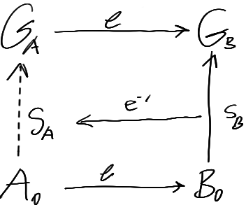

I have this idea which is primarily situated in my internal semantics right now, but can be weakly informed by some potential names for the idea / related idea names:
Flexible interfaces, flexible modules, mutually supportive modules, mutually supportive modules

Consider the situation: a system containing modules A, B with lossy / lossless translations between them, where module A doesn't have a function f with some particular functionality, and where module B has a function g which is equivalent to f but in B
A can translate to B via some function e, then g can be applied, then the result can be translated back to A, and this is equivalent to f: $f\ x = e^{-1}\ g\ e\ x$
This gives A more abilities because it can use B's functions

This looks like:

And in this case even if $e, e^{-1}$ are lossy, if A, B are connected to many other modules, those modules can mutually corrected eachothers values and converge to more accurate values for A, B
The whole network of modules converges to a 'better' state because of this mechanism

Another related situation like above is:
You have some problem-solution space A (representing progress in solving some problem) in which you are at some point $A_0$ which represents your knowledge of the problem and solution so far. In this space you *don't* have a path $S_A$ from your current state $A_0$ to your goalstate $G_A$, and you may not even know where $G_A$ is. Then you reinterpret via $e$ the space to another, simpler space B where you end up at $B_0$ with goalstate $G_B$, and where there is a path $S_B$ from $B_0$ to $G_B$. Then you interpret $S_B$ back to $S_A$

This looks like

Practically speaking, this may look something like $e:\mathbb{R}^N \rightarrow \mathbb{R}^n$ then a solver running on the output, then another function $e_v^{-1}: \mathbb{R}^n \times \mathbb{R}^n \rightarrow \mathbb{R}^N$ taking a vector and a point in the output space and producing a vector in original space. Each tangent vector from the solution (a path through the output space) can be translated back into the original space via this vector translation
Or even just translating each step of the output space solution back into the original space

---

In general I call modules like B that are produced by A via reversible lossy translation e and that have their own internal functions that can be used to add functionality to A *models* because they essentially act like simplified versions of A and could be used by the system just like we use models

eg: Of a model people use to describe / predict a system: representing the waves in an ocean as a vector field allows people to compress all of the complexities of the ocean into a simple representation which is well defined and useful in exactly the ways a vector field is useful

eg: Of a *model* as defined above: module A contains representations for objects and geometries of the area immediately around the system and is updates continuously as the system moves around the world, and as it imagines itself moving around the worl, module B is a two dimensional *map*-like representation with objects as points and two dimensional regions. Its obviously more difficult to navigate over a large distance in module A because there is so much more information that must be sifted through to get to the information which is related to the task, and module B contains only the information relevant to navigating. At the same time, module B is lossy wrt A because a lot of information is thrown of when interpreting A to B

